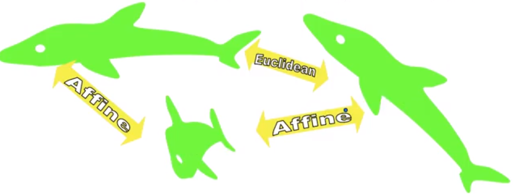
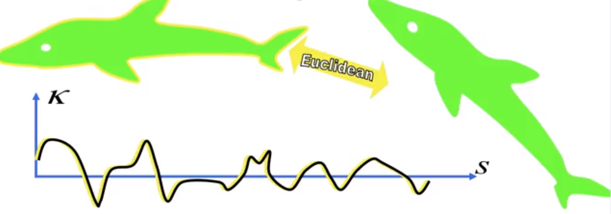
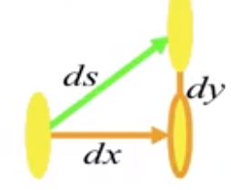
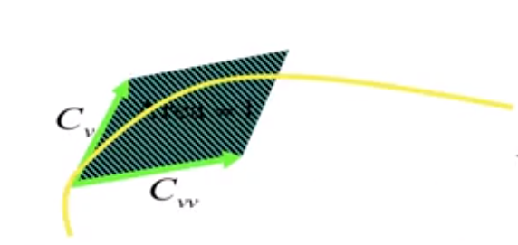
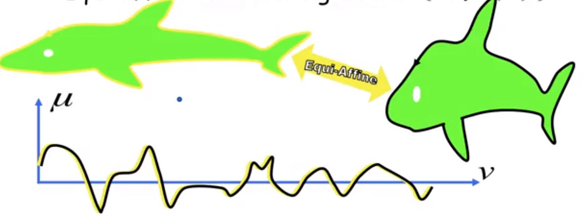

# Planar Differential Geometry

## Planar Curves
$C(p)=\left\{x(p),y(p)\right\},\quad p\in\left[0,1\right]$

If the curve is closed, then $C(0)=C(1)$.

**Simplified Notation:** $C_p=\frac{\partial C}{\partial p} = [x_p,y_p]$ 

*The derivative of a function gives you a vector that tangent to the function.*  

**tangent:** $\vec{t}=\frac{C_p}{|C_p|}=C_s$  
$s$ means, we find a parameter $s$, and instead of parameterized in $p$, the curve parameterized in such a way, that the tangent $C_s$ is always unti length.  
$$
|C_s|=1 \Rightarrow \left\langle C_s,C_s\right\rangle=1 \\
\frac{\partial\left\langle C_s,C_s\right\rangle}{\partial s}=2\left\langle C_{ss},C_s\right\rangle=\frac{\partial 1}{\partial s}=0\\
\left\langle C_{ss},C_s\right\rangle=0 \Rightarrow C_{ss}\bot C_s
$$
$C_{ss}$ is pendicular to $C_s$, but haven't to be a unit vector. So  
$$
C_{ss} = \kappa\vec{n}
$$
$\vec{n}$ is the normal, and $\kappa$ is defined as **curvature**, $s$ is called arclength.

## Linear Transformations
**Affine**: $\{\tilde{x}, \tilde{y}\}^T=A\{x, y\}^T+\bar{b}$  
**Equi-Affine**(the area is preserved): $\{\tilde{x}, \tilde{y}\}^T=A\{x, y\}^T+\bar{b}, \text{det}(A)=1$  
**Euclidean**(translation & rotation): $A=\left[\bar{u}_1, \bar{u}_2\right\rfloor \text { where }\left\langle\bar{u}_1, \bar{u}_2\right\rangle=0 \text { and }\left\langle\bar{u}_i, \bar{u}_i\right\rangle=1$

***For simplity, the affine transformations mentioned later stand for equi-affine.*** 

## Differential Signatures
**Euclidean invariant signature:** $\left\{s,\kappa(s)\right\}$  
The pair $\left\{s,\kappa(s)\right\}$ uniquely identifies the curve, meaning the shape up to a rotation and translation. It dont change after basic translation and rotation.

## Invariant arclength should be
1. Re-parameterization invariant  
The parameter just represent the velocity to traverse the curve, and the geometric meausure is invariant.  
$w=\int F\left(C, C_p, C_{p p}, \ldots\right) d p=\int F\left(C, C_r, C_{r r}, \ldots\right) d r$
2. Invariant under the group of the transformations

## Euclidean arclength
  
With Euclidean transformations, the length is preserved, thus  
$$
\begin{aligned}
C&=\left\{x(p),y(p)\right\}\Rightarrow C_p=\left\{\frac{dx}{dp},\frac{dy}{dp}\right\} \\
d s&=\sqrt{d x^2+d y^2}=\frac{d p}{d p} \sqrt{d x^2+d y^2}=d p \sqrt{(d x / d p)^2+(d y / d p)^2}=\left\lvert C_p\right\rvert d p \\
s&=\int d s=\int\left\lvert C_p\right\rvert d p \\
\text { Length } L&=\int_0^1\left\lvert C_p\right\rvert d p=\int_0\left\langle C_p, C_p\right\rangle^{1 / 2} d p=\int_0^{L} d s
\end{aligned}
$$

## Equi-affine arclength
  
Area is preserved, and $v$ is now the arclength. Now we are going to look for the $v$, that make the area equal to 1, as  
$$
\left(C_v,C_{vv}\right)=1
$$
where  
$$
\left(C_v,C_{vv}\right) = det\begin{bmatrix}x_v&x_{vv}\\y_v&y_{vv} \end{bmatrix}
$$

*Note: if we have a 2x2 matrix, combinded by 2 vectors, than the determinant of the matrix is the area of the parallelogram between these two vectors.*  

***Theorem:*** Any parameterization $p$ will give a parameterization $v$ that holds $\left(C_v,C_{vv}\right)=1$, following  
$$
v=\int\left(C_p, C_{p p}\right)^{1 / 3} d p
$$
The proof is omitted, and just believe it now. 
Then we can take $p$ equal to $s$, as  
$$
v=\int\left(C_s, C_{s s}\right)^{1 / 3} d s = \int \kappa^{1 / 3} d s
$$
And we get a extremely interesting relationship between Euclidean arclength and Equi-Affine arclength  
$$
dv=\kappa^{1/3}ds
$$

## Equi-affine curvature
Similar to what we did for the Euclidean case,  
$$
\begin{aligned}
\left(C_v, C_{v v}\right)=1 & \Rightarrow \frac{d}{d v}\left(C_v, C_{v v}\right)=0 \\
& \Rightarrow\left(C_{w v}, C_{v v}\right)+\left(C_v, C_{w v}\right)=0 \\
& \Rightarrow\left(C_v, C_{v v}\right)=0 \\
& \Rightarrow C_v \| C_{w v} \Rightarrow C_{w v}=\mu C_v
\end{aligned}
$$
$\mu$ is the affine invariant curvature.  

**Euclidean invariant signature:** $\left\{v,\mu(v)\right\}$  

